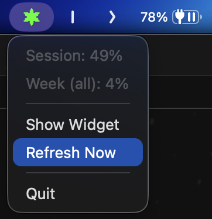

# ustats

A sleek macOS menu bar app that monitors your Claude API subscription usage in real time.

Built with [Tauri v2](https://v2.tauri.app/) (Rust + vanilla JS), ustats gives you a glanceable, always-on-top widget and a system tray dropdown so you never accidentally blow through your rate limits.

## Screenshots

**Floating widget** — always-on-top, draggable, CRT-terminal aesthetic:


**Menu bar dropdown** — quick glance without leaving what you're doing:



## Features

- **Real-time usage tracking** — monitors Session (5h window) and Weekly rate-limit buckets
- **Dual UI** — floating desktop widget + native macOS menu bar dropdown
- **Color-coded alerts** — green / yellow / red tray icon based on utilization thresholds (70% / 90%)
- **CRT terminal look** — phosphor green on black, scanline overlay, JetBrains Mono font
- **Auto-refresh** — polls the Anthropic API every 60 seconds with a minimal ~2-token probe
- **Zero config** — automatically picks up your Claude Code OAuth token from macOS Keychain
- **Lightweight** — native Rust backend, no Electron, minimal resource footprint

## How It Works

ustats sends a tiny API call (`max_tokens: 1`) to the Anthropic Messages endpoint and reads the rate-limit headers back:

```
anthropic-ratelimit-unified-{window}-utilization
anthropic-ratelimit-unified-{window}-reset
```

This costs virtually nothing and works even on 429 responses.

## Getting Started

### Prerequisites

- macOS
- [Rust](https://rustup.rs/) (stable)
- [Node.js](https://nodejs.org/) (for the Tauri CLI)

### Install & Run

```bash
git clone https://github.com/musichook/ustats.git
cd ustats
npm install
npm run dev
```

### Build for Production

```bash
npm run build
```

The `.dmg` / `.app` bundle will be in `src-tauri/target/release/bundle/`.

## Configuration

Config lives at `~/Library/Application Support/ustats/config.toml`:

```toml
[auth]
api_key = ""          # optional — falls back to Keychain / ANTHROPIC_API_KEY

[polling]
interval_seconds = 60

[widget]
show_on_launch = true
position_x = 100.0
position_y = 100.0
```

### Auth Priority

1. Claude Code OAuth token (macOS Keychain)
2. `ANTHROPIC_API_KEY` environment variable
3. `api_key` in config file

## Tech Stack

| Layer | Tech |
|-------|------|
| Backend | Rust, Tauri v2, reqwest, tokio |
| Frontend | Vanilla HTML/CSS/JS |
| Font | JetBrains Mono |
| Platform | macOS (private API for transparent windows) |

## License

MIT
